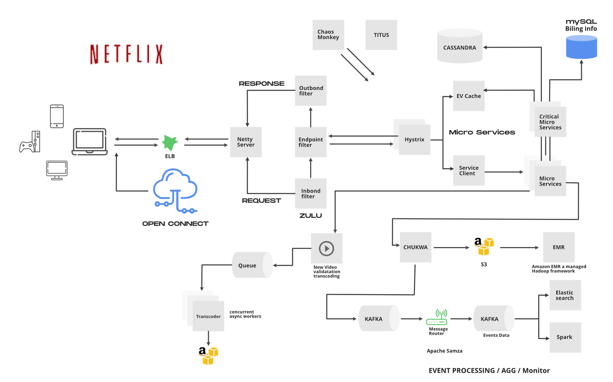

# Netflix System Design

## Table of Contents
1. [Overview](#overview)
2. [System Requirements](#system-requirements)
3. [Architecture](#architecture)
   - [Low-Level Design](#low-level-design)
   - [High-Level Design](#high-level-design)
4. [API Design](#api-design)
5. [Database Design](#database-design)
6. [Microservices](#microservices)
7. [Scalability](#scalability)
8. [Conclusion](#conclusion)

---

## Overview

Netflix is a leading video streaming service offering a vast library of movies, TV shows, documentaries, and original content. This document outlines the system design and architecture for key features such as video streaming, user personalization, content discovery, and recommendation engines.

## System Requirements

### Functional Requirements

- **User Management:** Users can sign up, log in, manage their profiles, and subscribe to plans.
- **Content Streaming:** Users can stream videos on various devices with adaptive bitrate streaming.
- **Search & Discovery:** Users can search for content based on titles, genres, actors, and directors.
- **Recommendation System:** Personalized content recommendations based on user preferences and viewing history.
- **Content Management:** Ability to add, update, and manage content in the library.
- **Watchlist:** Users can add content to their watchlist for future viewing.
- **Playback Tracking:** Resume watching from where a user left off, across different devices.
- **Review & Rating:** Users can rate and review content they have watched.

### Non-Functional Requirements

- **Scalability:** Handle millions of users concurrently streaming content.
- **Low Latency:** Provide seamless streaming with minimal buffering.
- **High Availability:** Ensure the service is available 24/7.
- **Data Durability:** Safeguard user data and content metadata against loss.
- **Consistency:** Provide accurate user data and content availability across regions.
- **Security:** Protect user data and content against unauthorized access.

## Capacity Estimation

### Key Metrics

- **Daily Active Users:** 200 million.
- **Average Streaming Hours per User per Day:** 2 hours.
- **Average Video Bitrate:** 5 Mbps.
- **Daily Content Uploads:** 1,000 titles.
- **Average Content Size:** 2 GB per hour of video.

### Bandwidth and Storage Estimation

- **Daily Streaming Data:** 
  \[ \text{Daily Active Users} \times \text{Average Streaming Hours per User} \times \text{Average Video Bitrate} \]
  \[ = 200 \text{ million users} \times 2 \text{ hours} \times 5 \text{ Mbps} \]
  \[ = 2 \text{ billion hours} \times 5 \text{ Mbps} \]
  \[ = 10 \text{ billion Mbps} = 10 \text{ Petabits per day} \approx 1.25 \text{ Petabytes per day} \]

- **Annual Storage Requirement for Uploads:**
  \[ \text{Daily Content Uploads} \times \text{Average Content Size} \times 365 \]
  \[ = 1,000 \text{ titles} \times 2 \text{ GB} \times 365 \]
  \[ = 730 \text{ TB per year} \]

## Architecture

### Low-Level Design

#### Core Components

1. **User Service**
   - Manages user accounts, authentication, and profiles.
   - Handles subscription plans and billing.
   - Stores user settings and preferences.

2. **Content Service**
   - Handles uploading, encoding, and storage of video content.
   - Manages metadata, including titles, descriptions, genres, and thumbnails.
   - Supports content categorization and tagging.

3. **Streaming Service**
   - Provides adaptive bitrate streaming to deliver content optimally based on user’s network conditions.
   - Integrates with Content Delivery Networks (CDNs) for global content distribution.

4. **Recommendation Service**
   - Personalizes content recommendations based on viewing history, preferences, and collaborative filtering.
   - Utilizes machine learning algorithms to generate real-time recommendations.

5. **Search Service**
   - Enables searching for content based on various attributes like title, genre, and cast.
   - Supports auto-complete and filters for enhanced search experience.

6. **Playback Service**
   - Tracks user playback progress and maintains continuity across devices.
   - Supports bookmarking and watchlist management.

7. **Analytics Service**
   - Gathers data on user behavior, content performance, and platform usage.
   - Provides insights for optimizing content recommendations and user engagement.

8. **Notification Service**
   - Sends notifications about new releases, personalized recommendations, and account-related updates.
   - Integrates with push notification services for real-time alerts.

### High-Level Design

Netflix’s system architecture is designed to handle large-scale video streaming efficiently. The architecture includes the following components and interactions:

#### Content Delivery

- **Client Devices**: Devices where users stream content (e.g., smartphones, tablets, smart TVs).
- **Content Management System (CMS)**: Manages uploading, encoding, and metadata of video content.
- **Content Delivery Networks (CDNs)**: Distribute video content to edge servers located globally for efficient delivery.
- **Video Streaming Servers**: Handle the distribution of video streams to users based on their network conditions.

#### Data Flow

- **User Interactions**: Users interact with the Netflix application to browse, search, and play content.
- **APIs and Microservices**: Handle user requests and serve responses from various services (e.g., search, recommendations, user profiles).
- **Recommendation Engine**: Analyzes user data to generate personalized recommendations.
- **Analytics and Monitoring**: Collects data on user behavior and system performance for real-time analytics and monitoring.

## API Design

### Example API Endpoints

**User Management**
- **POST /users/register**: Registers a new user.
- **POST /users/login**: Authenticates a user and provides a token.
- **GET /users/profile**: Retrieves the user's profile information.
- **PUT /users/profile**: Updates the user's profile information.

**Content Management**
- **POST /content**: Uploads a new video.
- **GET /content/{content_id}**: Retrieves metadata for a specific video.
- **PUT /content/{content_id}**: Updates metadata for a specific video.
- **DELETE /content/{content_id}**: Deletes a specific video.

**Streaming**
- **GET /stream/{content_id}**: Streams the video content to the user.
- **POST /stream/{content_id}/track**: Tracks playback progress for the user.

**Search & Discovery**
- **POST /search**: Searches for content based on query parameters.
- **GET /recommendations**: Retrieves personalized recommendations for the user.

**Watchlist & Playback**
- **POST /watchlist**: Adds content to the user's watchlist.
- **GET /watchlist**: Retrieves the user's watchlist.
- **POST /playback**: Updates playback position for the user.
- **GET /playback**: Retrieves playback position for the user.

## Database Design

### Example Tables

#### User

| Field              | Type          | Description             |
|--------------------|---------------|-------------------------|
| userId             | string (PK)   | Unique identifier for the user |
| email              | string        | User's email address    |
| passwordHash       | string        | Hashed password         |
| profileData        | JSON          | User's profile information |

#### Content

| Field             | Type          | Description               |
|-------------------|---------------|---------------------------|
| contentId         | string (PK)   | Unique identifier for the content |
| title             | string        | Title of the content      |
| description       | string        | Description of the content |
| genre             | string        | Genre of the content      |
| metadata          | JSON          | Additional metadata (e.g., actors, directors) |
| uploadDate        | datetime      | Date of content upload    |

#### Watchlist

| Field          | Type          | Description             |
|----------------|---------------|-------------------------|
| userId         | string (PK)   | User identifier         |
| contentId      | string (PK)   | Content identifier      |
| addedDate      | datetime      | Date added to watchlist |

#### Playback

| Field           | Type          | Description                 |
|-----------------|---------------|-----------------------------|
| userId          | string (PK)   | User identifier             |
| contentId       | string (PK)   | Content identifier          |
| playbackPosition| integer       | Playback position in seconds |

## Microservices

### Core Microservices

1. **User Service**: Manages user-related operations, authentication, and profiles.
2. **Content Service**: Handles content metadata management and storage.
3. **Streaming Service**: Manages video streaming and playback.
4. **Recommendation Service**: Provides personalized content recommendations.
5. **Search Service**: Handles content search and discovery operations.
6. **Analytics Service**: Collects and analyzes user interaction data.
7. **Notification Service**: Manages notifications to users about new content and updates.

### Integration and Communication

- **APIs**: Each microservice exposes APIs for interaction.
- **Message Queues**: Used for asynchronous communication and event handling.
- **Service Discovery**: Ensures microservices can find each other dynamically.

## Scalability

### Techniques

1. **Elastic Load Balancing**: Distributes incoming traffic

 across multiple servers.
2. **Horizontal Scaling**: Adds more servers to handle increased traffic.
3. **Database Sharding**: Splits data across multiple databases to manage load.
4. **Content Delivery Networks (CDNs)**: Distributes content to servers closer to users for faster access.
5. **Caching**: Uses caching mechanisms to reduce database load and improve response times.

### Latency Reduction

1. **Edge Servers**: Deploys edge servers globally for reduced latency.
2. **Adaptive Streaming**: Uses adaptive bitrate streaming to optimize video quality based on network conditions.

### Availability

1. **Failover Mechanisms**: Implements failover mechanisms for high availability.
2. **Replication**: Uses data replication across regions for continuous availability.

### Reliability

1. **Redundant Infrastructure**: Implements redundancy at various levels to ensure reliability.
2. **Monitoring & Alerts**: Uses real-time monitoring and alerts to detect and address issues quickly.

## Conclusion

Designing a scalable and efficient system for Netflix, integration of multiple services for content management, user interactions, and streaming is essential. The architecture must guarantee high availability, low latency, and a personalized user experience to cater to millions of users globally.

By implementing a microservices architecture, leveraging CDNs, and incorporating advanced algorithms for content recommendations, Netflix can deliver a seamless and engaging viewing experience for its users.